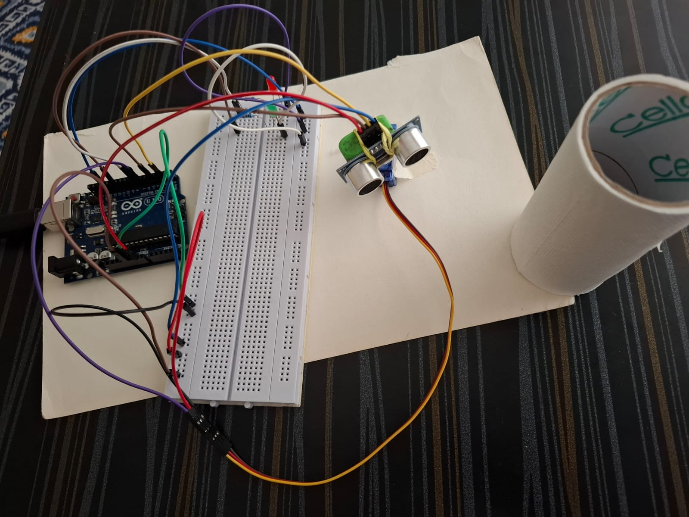

# Ultrasonic Servo Scanner

An Arduino Uno project where an HC-SR04 ultrasonic sensor is mounted on a servo. The servo sweeps the sensor from 0° to 180° and back, measuring distance at every degree. A green LED lights up when an object is close, and a red LED lights up when nothing is in range.

https://github.com/user-attachments/assets/82c7b9f6-4553-436d-b402-efaadfaa7c09

## Components

- Arduino Uno
- HC-SR04 ultrasonic sensor
- Micro servo (SG90 type)
- Red LED and green LED, each with a current-limiting resistor
- Breadboard and jumper wires

## Pin connections

| Part | Arduino pin |
|---|---|
| Servo signal | 7 |
| Ultrasonic TRIG | 2 |
| Ultrasonic ECHO | 4 |
| Red LED | 8 |
| Green LED | 12 |

## How it works

1. The servo moves one degree at a time from 0° to 180°, then back to 0°.
2. At each angle, the Arduino sends a 10 µs pulse to the TRIG pin. The sensor sends out an ultrasonic ping.
3. `pulseIn()` measures how long the echo takes to return, in microseconds.
4. If the echo time is above 0 and below 750 µs (roughly 13 cm), the green LED turns on and the red LED turns off.
5. Otherwise, the red LED turns on and the green LED turns off.
6. The raw echo time is printed to the Serial Monitor at 9600 baud, so you can watch the readings.

## Code

See [`ultrasonic_servo_sensor_code.ino`](ultrasonic_servo_sensor_code.ino). It uses the built-in `Servo.h` library.

## What I learned

- Reading distance with an ultrasonic sensor using `pulseIn()`
- Controlling a servo while taking measurements in the same loop
- Using LEDs as a simple "object detected" indicator
